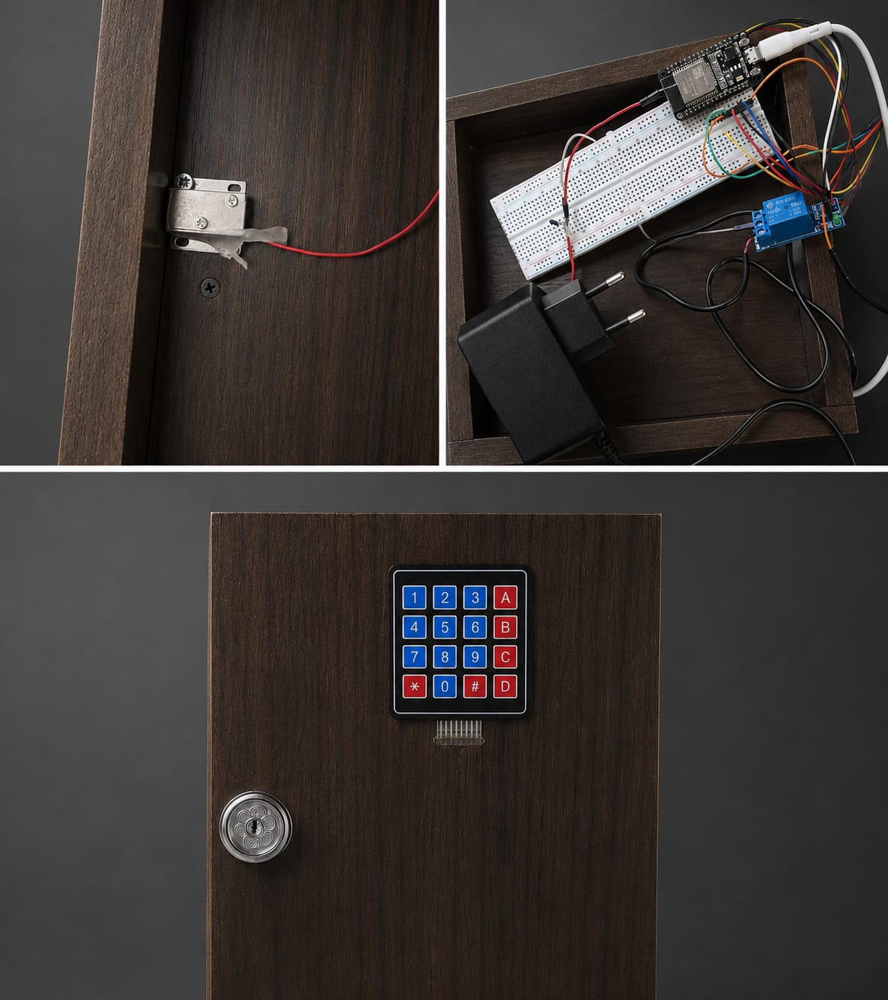

#  ESP32 Smart Security & Access Control System

##  Overview
This project implements a robust physical security and access control system utilizing an **ESP32** microcontroller. The system requires multi-factor logic (RFID tags and PIN codes) to authenticate users and trigger a relay-driven solenoid lock, demonstrating practical embedded systems design and hardware integration.

##  Key Features
* **RFID Authentication:** Reads and verifies UID tags using the RC522 module.
* **PIN Code Verification:** Allows manual passcode entry via a 4x4 membrane keypad.
* **Actuator Control:** Controls a high-power solenoid lock securely using a Relay module.
* **Non-Blocking Logic:** Implements efficient timing and sensor polling mechanisms avoiding standard `delay()` bottlenecks.
* **Feedback System:** Provides immediate visual/audio feedback (Buzzer) upon access granted or denied.

##  Hardware & Tech Stack
* **Microcontroller:** ESP32 (Wi-Fi/Bluetooth ready for future IoT expansion)
* **Components:** * RFID-RC522 Reader
    * 4x4 Membrane Keypad
    * 5V Relay Module & Solenoid Lock
    * Active Buzzer
* **Language & Environment:** C++ / Arduino Framework

##  Circuit Schematic / Project Image


##  How to Run/Flash
1. Clone the repository:
   ```bash
   git clone https://github.com/MotazAlgawagneh/ESP32-Smart-Security-System.git
   ```
   
2. Open the .ino file using the Arduino IDE.
   
3. Ensure the following libraries are installed via the Library Manager:

    *MFRC522 (for the RFID module)
    *Keypad (for the 4x4 matrix keypad)
   
4. Select your ESP32 Dev Module board and the correct COM port.

5. Click Upload to flash the code onto the ESP32.
